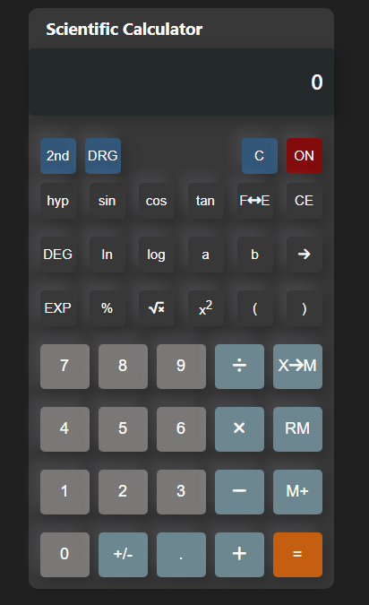

## Table of contents

- [Overview](#overview)
  - [The challenge](#the-challenge)
  - [Screenshot](#screenshot)
  - [Links](#links)
- [My process](#my-process)
  - [Built with](#built-with)
  - [What I learned](#what-i-learned)
  - [Useful resources](#useful-resources)
- [Author](#author)

## Overview

A beautiful, free online scientific calculator with advanced features for evaluating percentages, fractions, exponential functions, logarithms, trigonometry, statistics, and more.

### The challenge

Users should be able to:

- View the optimal layout for the calculator depending on their device's screen size
- See hover states for all interactive buttons on the calculator
- use the calculator to carry out all the alegbra expressions
- Use the calculator either in standard or scientific mode (include advanced operations)

### Screenshot



### Links

- Solution URL: [Add solution URL here](https://your-solution-url.com)
- Live Site URL: [Add live site URL here](https://your-live-site-url.com)

## My process

- I am setting up a basic file structure for the project and writing the (markup and styling) for the app without adding functionality to any button.

- Since am having no design document for the app, innitialy am picking motivation from the windows calculator app but with the first few shots at it, doesn't come off very well. My mentor assits me have a look at a normal Casio Scientific Calculator and then I use it as reference to build the UI of the app.

# Functionality

- For the app Functionality, I began with updating the Calculator display Screen when the user clicks on the number buttons by replacing the HTML(DOM) element's textContent with the textContent from the number button element

- After being satsified with the results, I handle the event when the user clicks on the basic Math operator buttons and those are (add, subtract, divide & multiply)

Am handling the functionality of this buttons step by step, first by logging them into the console and then later ensure that they perform as expected.

### Built with

- Semantic HTML5 markup
- CSS custom properties
- Flexbox
- Desktop-first workflow
- Vanilla JavaScript

### What I learned

- I have learned about Events and Event handling, I faced a situation where the handler function I had set apart to take effect when the user interacts with the button is not being excuted because I was calling it in the wrong place. This was an issue with the my JS syntax

```JS
numberButtonsArray.forEach((numberBtn) =>
  numberBtn.addEventListener("click", appendNumberValue())
);
```

- I also got the chance to be exposed to Event Capturing and Event Bubbling as I was trying to validate if the button is an operator button by checking for the (event.target) and at instance where the button had another nested element, Everytime the user clicked on the nested element the (event.target) couldn't tally and one way I erectfied this was targeting for the (event.currentTarget).

### Useful resources

- [Bubbling and capturing(The Modern JavaScript Tutorial)](https://javascript.info/bubbling-and-capturing) - This helped me understand more about Event Capturing and Event Bubbling. I really liked this article and I highly recommend it to anyone who comes across the same obstacle during development.

## Author

# Ssembatya Dennis Duncan

- Twitter - [@DennisSsembatya](https://twitter.com/DennisSsembatya)
